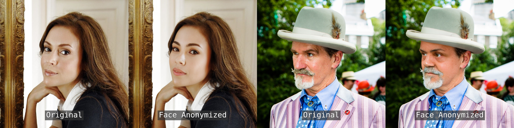

# Face Anonymization Made Simple (WACV 2025)

[arXiv](http://arxiv.org/abs/2411.00762)



Our face anonymization technique preserves the original facial expressions, head positioning, eye direction, and background elements, effectively masking identity while retaining other crucial details. The anonymized face blends seamlessly into its original photograph, making it ideal for diverse real-world applications.

## Setup

1. Clone the repository.

```bash
git clone https://github.com/hanweikung/face_anon_simple.git
```

2. Create a Python environment from the `environment.yml` file.

```bash
conda env create -f environment.yml
```

## Usage
1. Import the library.

```python
import torch
from transformers import CLIPImageProcessor, CLIPVisionModel

from diffusers import AutoencoderKL, DDPMScheduler
from diffusers.utils import load_image
from src.diffusers.models.referencenet.referencenet_unet_2d_condition import (
    ReferenceNetModel,
)
from src.diffusers.models.referencenet.unet_2d_condition import UNet2DConditionModel
from src.diffusers.pipelines.referencenet.pipeline_referencenet import (
    StableDiffusionReferenceNetPipeline,
)
```

2. Create & load models.

```python
face_model_id = "hkung/face-anon-simple"
clip_model_id = "openai/clip-vit-large-patch14"
sd_model_id = "stabilityai/stable-diffusion-2-1"

unet = UNet2DConditionModel.from_pretrained(
    face_model_id, subfolder="unet", use_safetensors=True
)
referencenet = ReferenceNetModel.from_pretrained(
    face_model_id, subfolder="referencenet", use_safetensors=True
)
conditioning_referencenet = ReferenceNetModel.from_pretrained(
    face_model_id, subfolder="conditioning_referencenet", use_safetensors=True
)
vae = AutoencoderKL.from_pretrained(sd_model_id, subfolder="vae", use_safetensors=True)
scheduler = DDPMScheduler.from_pretrained(
    sd_model_id, subfolder="scheduler", use_safetensors=True
)
feature_extractor = CLIPImageProcessor.from_pretrained(
    clip_model_id, use_safetensors=True
)
image_encoder = CLIPVisionModel.from_pretrained(clip_model_id, use_safetensors=True)

pipe = StableDiffusionReferenceNetPipeline(
    unet=unet,
    referencenet=referencenet,
    conditioning_referencenet=conditioning_referencenet,
    vae=vae,
    feature_extractor=feature_extractor,
    image_encoder=image_encoder,
    scheduler=scheduler,
)
pipe = pipe.to("cuda")

generator = torch.manual_seed(1)
```

### Anonymize images with a single aligned face

Create an anonymized version of an image if the image contains a single face and that face has already been aligned similarly to those in the [FFHQ](https://github.com/NVlabs/ffhq-dataset) or [CelebA-HQ](https://github.com/tkarras/progressive_growing_of_gans) datasets.

```python
# get an input image for anonymization
original_image = load_image("my_dataset/test/14795.png")

# generate an image that anonymizes faces
anon_image = pipe(
    source_image=original_image,
    conditioning_image=original_image,
    num_inference_steps=200,
    guidance_scale=4.0,
    generator=generator,
    anonymization_degree=1.25,
    width=512,
    height=512,
).images[0]
anon_image.save("anon.png")
```

### Anonymize images with one or multiple unaligned faces

Create an anonymized version of an image if it contains one or more unaligned faces.

```python
import face_alignment
from utils.anonymize_faces_in_image import anonymize_faces_in_image

# get an input image for anonymization
original_image = load_image("my_dataset/test/friends.jpg")

# SFD (likely best results, but slower)
fa = face_alignment.FaceAlignment(
    face_alignment.LandmarksType.TWO_D, face_detector="sfd"
)

# generate an image that anonymizes faces
anon_image = anonymize_faces_in_image(
    image=original_image,
    face_alignment=fa,
    pipe=pipe,
    generator=generator,
    face_image_size=512,
    num_inference_steps=25,
    guidance_scale=4.0,
    anonymization_degree=1.25,
)
anon_image.save("anon.png")
```

### Swap faces between two images

Create an image that swap faces.

```python
# get source and conditioning (driving) images for face swap
source_image = load_image("my_dataset/test/00482.png")
conditioning_image = load_image("my_dataset/test/14795.png")

# generate an image that swaps faces
swap_image = pipe(
    source_image=source_image,
    conditioning_image=conditioning_image,
    num_inference_steps=200,
    guidance_scale=4.0,
    generator=generator,
    anonymization_degree=0.0,
    width=512,
    height=512,
).images[0]
swap_image.save("swap.png")
```

We also provide the [demo.ipynb](https://github.com/hanweikung/face_anon_simple/blob/main/demo.ipynb) notebook, which guides you through the steps mentioned above.

### Note on image resolution

Our model was trained on 512x512 images. To ensure correct results, always set `width=512` and `height=512` in the `pipe` function, and `face_image_size=512` in the `anonymize_faces_in_image` function. This ensures that input images are resized correctly for the diffusion pipeline. If you're using a model trained on different sizes, like 768x768, adjust these parameters accordingly.

## Training

Our model learns face swapping for anonymization. You can train it using your own face-swapped images.

### Training data structure

Sample training data is available in the `my_dataset/train` directory. Real images are stored in the `real` subdirectory, while face-swapped images are stored in the `fake` subdirectory.

```bash
my_dataset/
├── train
│   ├── celeb
│   │   ├── fake
│   │   │   └── 18147_06771-01758_01758.png
│   │   └── real
│   │       ├── 01758_01758.png
│   │       ├── 01758_09704.png
│   │       └── 18147_06771.png
│   └── train.jsonl
└── train_dataset_loading_script.py
```

### Data loading and configuration

Training data is loaded using a JSON lines file (`my_dataset/train.jsonl`) and a dataset loading script (`my_dataset/train_dataset_loading_script.py`), both provided as examples.

The JSON lines file includes two sample entries specifying the source image, conditioning (driving) image, and ground truth image, with file paths based on the sample training data. Adjust these paths to match your own data:

```json
{"source_image": "celeb/real/18147_06771.png", "conditioning_image": "celeb/real/01758_01758.png", "ground_truth": "celeb/fake/18147_06771-01758_01758.png"}
{"source_image": "celeb/real/01758_09704.png", "conditioning_image": "celeb/fake/18147_06771-01758_01758.png", "ground_truth": "celeb/real/01758_01758.png"}
```

To simulate face-swapping behavior, the source and conditioning images should have different identities. The source and ground truth should share the same identity, while the conditioning and ground truth should share the same pose and expression. When no actual ground truth is available (e.g., the first entry), the face-swapped image serves as the ground truth. When a ground truth image is available (e.g., the second entry), the swapped version of the ground truth is used as the conditioning image.

Our dataset loading script follows [Hugging Face's documentation](https://huggingface.co/docs/datasets/en/dataset_script). Please update the `metadata_path` and `images_dir` file paths in the script to match your dataset:

```python
_URLS = {
    "metadata_path": "/path/to/face_anon_simple/my_dataset/train/train.jsonl",
    "images_dir": "/path/to/face_anon_simple/my_dataset/train/",
}
```

### Training script setup

A bash script, `train_referencenet.sh`, with the training command is provided. Update the file paths and adjust parameters as needed:

```bash
export MODEL_DIR="/path/to/stable-diffusion-2-1/"
export CLIP_MODEL_DIR="/path/to/clip-vit-large-patch14/"
export OUTPUT_DIR="./runs/celeb/"
export NCCL_P2P_DISABLE=1
export DATASET_LOADING_SCRIPT_PATH="./my_dataset/train_dataset_loading_script.py"
export TORCH_DISTRIBUTED_DEBUG="INFO"
export WANDB__SERVICE_WAIT="300"

accelerate launch --main_process_port=29500 --mixed_precision="fp16" --multi_gpu -m examples.referencenet.train_referencenet \
	--pretrained_model_name_or_path=$MODEL_DIR \
	--pretrained_clip_model_name_or_path=$CLIP_MODEL_DIR \
	--output_dir=$OUTPUT_DIR \
	--dataset_loading_script_path=$DATASET_LOADING_SCRIPT_PATH \
	--resolution=512 \
	--learning_rate=1e-5 \
	--validation_source_image "./my_dataset/test/00482.png" \
	--validation_conditioning_image "./my_dataset/test/14795.png" \
	--train_batch_size=1 \
	--tracker_project_name="celeb" \
	--checkpointing_steps=10000 \
	--num_validation_images=1 \
	--validation_steps=1000 \
	--mixed_precision="fp16" \
	--gradient_checkpointing \
	--use_8bit_adam \
	--enable_xformers_memory_efficient_attention \
	--gradient_accumulation_steps=8 \
	--resume_from_checkpoint="latest" \
	--set_grads_to_none \
	--max_train_steps=60000 \
	--conditioning_dropout_prob=0.1 \
	--seed=0 \
	--report_to="wandb" \
	--random_flip \
	--dataloader_num_workers=8
```

To train your model, run:

```bash
bash train_referencenet.sh
```

## Test images

In our paper, we selected 1,000 images each from [CelebA-HQ](https://github.com/tkarras/progressive_growing_of_gans) and [FFHQ](https://github.com/NVlabs/ffhq-dataset) for quantitative analysis. The list of test images can be found in our [Hugging Face Hub repository](https://huggingface.co/datasets/hkung/face-anon-simple-dataset).

## Citation

```bibtex
@InProceedings{Kung_2025_WACV,
    author    = {Kung, Han-Wei and Varanka, Tuomas and Saha, Sanjay and Sim, Terence and Sebe, Nicu},
    title     = {Face Anonymization Made Simple},
    booktitle = {Proceedings of the Winter Conference on Applications of Computer Vision (WACV)},
    month     = {February},
    year      = {2025},
    pages     = {1040-1050}
}
```

## Acknowledgements

This work is built upon the [Diffusers](https://github.com/huggingface/diffusers) project. The [face extractor](https://github.com/hanweikung/face_anon_simple/blob/main/utils/extractor.py) is adapted from [DeepFaceLab](https://github.com/iperov/DeepFaceLab/blob/master/mainscripts/Extractor.py).
